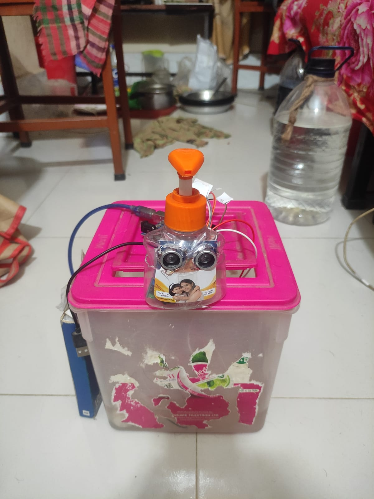
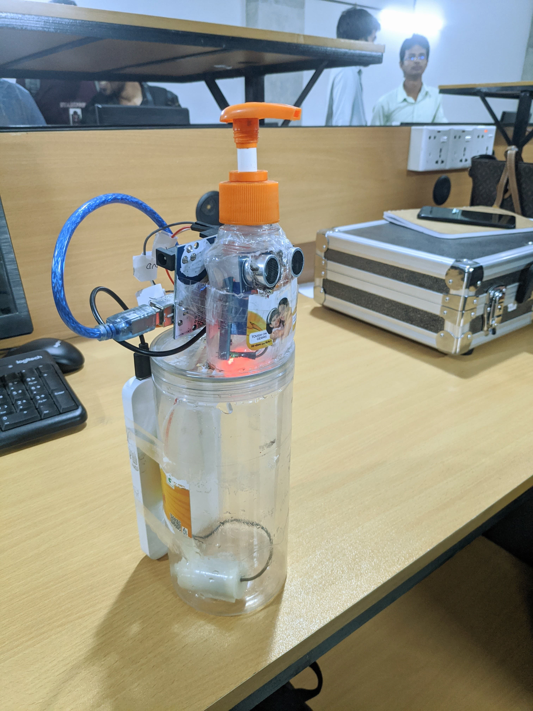

# Automatic Water Tap Project 🚰

An **Automatic Water Tap** system designed to promote hygiene and conserve water by using a relay module, ultrasonic sensor, Arduino, and a mini water pump. This project ensures water flows only when an object (like a hand) is detected under the tap. This project from 9th semester #Varendra_University 

---

## 📋 Table of Contents
1. [Overview](#overview)
2. [Features](#features)
3. [Components](#components)
4. [Circuit Diagram](#circuit-diagram)
5. [Step-by-Step Instructions](#step-by-step-instructions)
6. [Testing](#testing)
7. [Prototyping Images and Videos](#prototyping-images-and-videos)
8. [Results](#results)
9. [Future Enhancements](#future-enhancements)
10. [License](#license)

---

## Overview
This project combines the power of **Arduino microcontroller** and **ultrasonic sensors** to create a touch-free automatic water tap system. Perfect for kitchens, bathrooms, or public places, it helps maintain hygiene by avoiding direct contact with the tap.

---

## Features
- **Automatic Water Flow:** Water starts flowing when an object is detected within a specific range.
- **Energy Efficient:** Uses a relay module to control the water pump, reducing unnecessary power consumption.
- **Compact Design:** Easy to integrate into existing systems.

---

## Components
Here are the hardware components required for the project:
- Arduino Uno (or compatible microcontroller)
- Ultrasonic Sensor (e.g., HC-SR04)
- Relay Module
- Mini Water Pump
- Power Supply (e.g., 5V DC adapter, Powerbank)
- Jumper Wires
- Water Reservoir (for testing)

---

## Circuit Diagram
  


---

## Step-by-Step Instructions
Follow these steps to build and test the Automatic Water Tap project:

### Step 1: Gather Components
Collect all the necessary components listed above and ensure they are functioning.

### Step 2: Assemble the Circuit
1. Connect the **ultrasonic sensor** to the Arduino as follows:
   - **VCC** to 5V
   - **GND** to GND
   - **TRIG** to Arduino digital pin 7
   - **ECHO** to Arduino digital pin 6
2. Connect the **relay module**:
   - **Signal pin** to Arduino digital pin 8
   - **VCC** to 5V
   - **GND** to GND
3. Connect the **mini water pump** to the relay module as per its specifications.

### Step 3: Upload the Code
Upload the following Arduino code to your board:
```cpp
#define TRIG_PIN 9  // Trigger pin of ultrasonic sensor
#define ECHO_PIN 10 // Echo pin of ultrasonic sensor
#define RELAY_PIN 8 // Relay pin

void setup() {
  pinMode(TRIG_PIN, OUTPUT);  // Set trigger pin as output
  pinMode(ECHO_PIN, INPUT);   // Set echo pin as input
  pinMode(RELAY_PIN, OUTPUT); // Set relay pin as output
  digitalWrite(RELAY_PIN, LOW); // Initialize relay to OFF
  
  Serial.begin(9600); // Initialize serial communication
}

void loop() {
  // Send a 10-microsecond pulse to trigger pin
  digitalWrite(TRIG_PIN, LOW);
  delayMicroseconds(2);
  digitalWrite(TRIG_PIN, HIGH);
  delayMicroseconds(10);
  digitalWrite(TRIG_PIN, LOW);
  
  // Read the time for the echo
  long duration = pulseIn(ECHO_PIN, HIGH);
  
  // Calculate the distance in centimeters
  float distance = (duration * 0.034) / 2;
  
  // Print distance to Serial Monitor
  Serial.print("Distance: ");
  Serial.print(distance);
  Serial.println(" cm");
  
  // Check distance and control relay
  if (distance <= 10) { // If an object is within 10 cm
    digitalWrite(RELAY_PIN, HIGH); // Turn ON the relay
  } else {
    digitalWrite(RELAY_PIN, LOW); // Turn OFF the relay
  }
  
  delay(100); // Small delay
}
```

### Step 4: Testing
- Power up the circuit and place your hand or an object near the ultrasonic sensor.
- Observe if the water pump activates when an object is detected.

---

## Testing
During testing, ensure the following:
1. The ultrasonic sensor accurately detects objects within a range of **10 cm**.
2. The relay module switches the water pump ON/OFF as per the sensor's input.
3. The water pump runs smoothly without delays or interruptions.

---

## Prototyping Images and Videos

First Test

https://github.com/user-attachments/assets/3ee2aa59-2dc6-44c0-9c18-3957cd60e0c8

Test Video

https://github.com/user-attachments/assets/9b437a24-7118-419c-9326-06158ff03425

Initial Project



Final Project



We are 🙌


---

## Results
- **Accuracy:** The sensor successfully detects objects within 10 cm and activates the pump.
- **Efficiency:** The relay module efficiently manages the water pump's operation.
- **Outcome:** The system meets all design expectations and demonstrates practical usability.

---

## Future Enhancements
- Add an **LED indicator** to show system status.
- Implement **adjustable detection range** via a potentiometer.
- Integrate a **mobile app** for remote control and monitoring.

---

## License
This project is licensed under the MIT License. Feel free to use and modify the project for educational or personal use.

---

## Contributing
We welcome contributions! If you have ideas for improvements or spot a bug, feel free to create an issue or submit a pull request.

---

Happy Coding! 🚀
